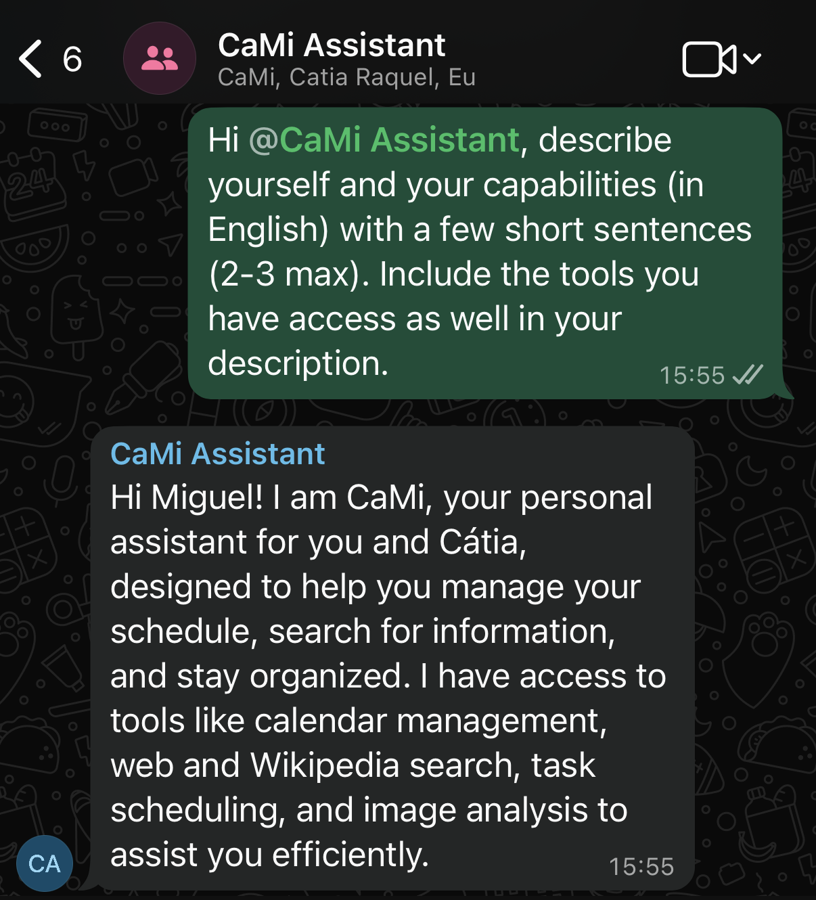

# CaMi Assistant

Personal WhatsApp assistant powered by **n8n** and **wwebjs-api**, designed to help with daily tasks, reminders, news, and more. The project runs two main services:

- **n8n**: workflow automation and AI agent
- **wwebjs-api**: WhatsApp Web bridge



## Minimal Setup

### 1. Start services

```bash
cd cami && podman compose up -d
```

Services will be available on host:

- n8n: `http://localhost:5678`
- WhatsApp API: `http://localhost:3000`

### 2. WhatsApp Setup

> Recommended: use an **old/secondary phone** to avoid disrupting your main WhatsApp session.

1. Start a session: `http://localhost:3000/session/start/personal`
2. Get QR code: `http://localhost:3000/session/qr/personal`
3. Render QR code using: `https://webqr.com/create.html`
4. Scan QR code with WhatsApp and associate it with the old/secondary phone.
5. Verify connection: `http://localhost:3000/session/status/personal`. You should see the session as **connected**

### 3. N8N Setup

1. Access n8n: `http://localhost:5678` and create new Workflow
2. Add a `Webhook` (Trigger) node with `POST` method and path `whatsapp-in`.
3. Add `AI Agent` node and connect it with your LLM provider.
4. Add a `HTTP Request` (Send message back) node with `POST` method and path `http://wwebjs-api:3000/client/sendMessage/personal`.

The output format for last node shall be:

```json
{
  "chatId": "YOUR_GROUP_ID@g.us",
  "contentType": "string",
  "content": "={{$json.output}}"
}
```

Where `YOUR_GROUP_ID` is WhatsApp group ID or chat ID, and `$json.output` is AI Agent output.